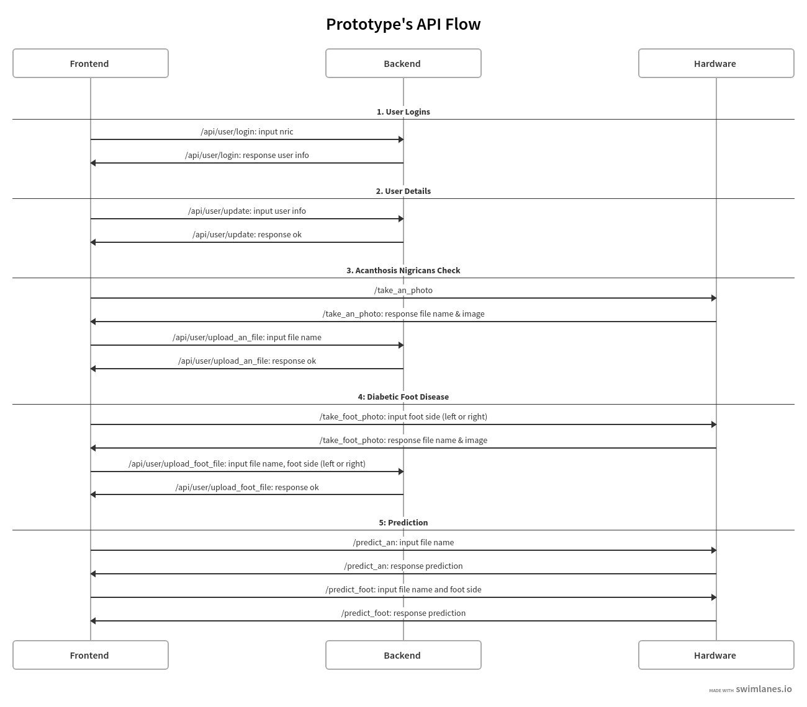

# Non-invasive diabetes diagnostic prediction

## Table of contents

- [Introduction](#introduction)
- [Purpose of Repository](#purpose-of-repository)
- [Sub-Processes Interaction](#sub-processes-interaction)
- [Repository Structure](#repository-structure)
  - [frontend](#frontend)
    - [How to run](#frontend-how-to-run)
  - [node_backend](#node-backend)
    - [How to run](#node-backend-how-to-run)
  - [flask_backend](#flask-backend)
    - [How to run](#flask-backend-how-to-run)
  - [cnn_model](#cnn-model)

## Introduction

This thesis entrepreneur project aims to provide a seamless, interactive expereince for any patients to have a quick diabetic diagnostic through Deep Learning model to predict the patient's risk before providing a recommendation on whether the patient should visit a doctor for a more in-depth diagnostics.

The thesis paper can be access here: `<work in progress>`

## Purpose of Repository

The purpose of this repository is to collate the development of the project.

## Sub-Processes Interaction

`<work in progress>`

## Repository Structure

### Frontend

The frontend was built using ReactJS in Typescript and State Management was utilizing Context API. The styling of the frontend is using `react-bootstrap` for quick prototyping purposes.

#### Frontend: How to run

1. Open terminal
2. `cd frontend`
3. `npm i`
4. `npm start`
5. The frontend should be running on `http://localhost:3000`

### Node Backend

The purpose of the node backend is to allow the frontend to interact with the database, as to retrieve patient's information such as height, weight and age.

The backend was built using NodeJS and ExpressJS in Typescript. The database used is PostgresSQL and is utilizing TypeORM to query the database.

#### Node Backend: How to run

1. Open terminal
2. `cd node_backend`
3. `npm i`
4. `npm run dev`
5. The Node API should be accessible via`http://localhost:4000`

### Flask Backend

The purpose of the flask backend is to allow the frontend to send calls to the Raspberry Pi 4 to perform system calls to activate the camera to take images which will be later used to run image prediction.

The backend was built in Flask.

#### Flask Backend: How to run

1. Open terminal
2. `cd flask_backend`
3. `python3 index.py`
4. The Flask API should be accessible via `http://localhost:5000`

### CNN Model

This folder contains the training of the Convolutional Neural Network (CNN) which the model is then used to predict the risk of the patient of having diabetes.

You can simply the `.ipynb` in Jupyter Notebook.
